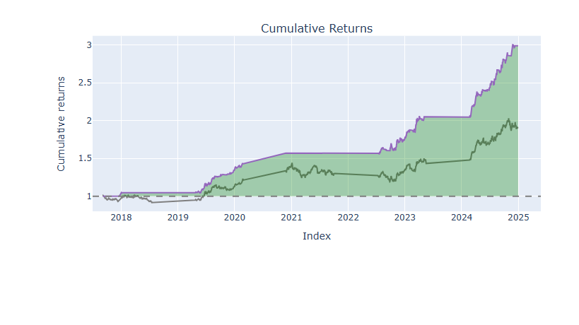

# Financial Asset Trend Prediction Pipeline with LSTM and XGBoost

## Project Overview

This project presents an end-to-end Machine Learning pipeline to predict short-term trends in financial assets. Utilizing a comprehensive set of features (technical indicators and macroeconomic data), the pipeline benchmarks two distinct model architectures: a sequential neural network (LSTM) and a tree-based ensemble (XGBoost).

The ultimate goal is to develop a quantitative trading strategy, rigorously tested via a professional backtesting engine with realistic transaction costs, and validated using the robust Walk-Forward method to ensure performance consistency across different market regimes.

**The primary outcome of this research is a highly profitable XGBoost-based strategy that demonstrated significant and consistent alpha, drastically outperforming the Buy & Hold benchmark over a 7+ year period.**

## Key Results (XGBoost Walk-Forward Validation)

The most rigorous validation method (Walk-Forward) confirmed the robustness of the XGBoost-based strategy over a multi-year backtest period (2017-2024).

| Metric | XGBoost Strategy | Benchmark (Buy & Hold) |
| :--- | :--- | :--- |
| **Total Return** | **+198.88%** | +89.76% |
| **Sharpe Ratio** | **3.10** | (N/A) |
| **Max Drawdown** | **-5.76%** | (Varies) |
| **Win Rate [%]** | **83.3%** | (N/A) |


*(The purple line represents the strategy's equity curve, while the gray line represents the benchmark.)*

## Key Features

- **Modular & Reusable Pipeline:** The codebase is fully modular, separating data loading, feature engineering, training, and backtesting into distinct, reusable components.
- **Comprehensive Feature Engineering:** Generates over 200 features, including a wide array of technical indicators and external macroeconomic data.
- **Robust Feature Selection:** Implements a selection funnel using a high-correlation filter and the BorutaPy algorithm to identify the most relevant predictors.
- **Model Benchmarking Framework:** The pipeline is flexible, allowing for the training and fair comparison of different model architectures (LSTM vs. XGBoost).
- **Professional Backtesting Engine:** Utilizes the `vectorbt` library for fast and realistic simulations, incorporating transaction costs like commissions and slippage.
- **Rigorous Validation Methods:** Implements both static train-test splits and a full Walk-Forward Validation to ensure the robustness of the findings.

## Project Structure

    /gld_lstm_strategy/
    |
    |-- 📂 configs/             # Configuration files (e.g., config.yaml)
    |-- 📂 data/                # Cached data (downloaded on the first run)
    |-- 📂 notebooks/           # Notebooks for analysis and pipeline execution
    |-- 📂 src/                 # Core project source code (.py modules)
    |-- 📜 .gitignore           # Files and folders to be ignored by Git
    |-- 📜 requirements.txt     # Python project dependencies
    |-- 📜 README.md            # This documentation file

## Tech Stack

- **Language:** Python 3
- **Core Libraries:**
  - **ML & Deep Learning:** TensorFlow, Keras, XGBoost, Scikit-learn
  - **Data Analysis:** Pandas, NumPy
  - **Backtesting:** vectorbt
  - **Feature Selection:** BorutaPy
  - **Data Sourcing:** yfinance

## Setup and Usage

Follow these instructions to set up the project environment and run the analyses on your local machine.

### 1. Prerequisites

Make sure you have the following installed on your system:
- Git
- Python (3.8 or higher)

### 2. Clone the Repository

First, clone the repository to your local machine using the command line:
```bash
git clone [https://github.com/rbertin77/gld-strategy-LTSM-XGBoost.git](https://github.com/rbertin77/gld-strategy-LTSM-XGBoost.git)
cd gld-strategy-LTSM-XGBoost
````

### 3. Create and Activate a Virtual Environment

It is highly recommended to use a virtual environment to keep project dependencies isolated.

**On Windows:**

```bash
# Create the virtual environment in a folder named 'venv'
python -m venv venv

# Activate the environment
.\venv\Scripts\activate
```

**On macOS / Linux:**

```bash
# Create the virtual environment in a folder named 'venv'
python3 -m venv venv

# Activate the environment
source venv/bin/activate
```

### 4. Install Dependencies

With your virtual environment activated, install all the required libraries from the `requirements.txt` file:

```bash
pip install -r requirements.txt
```

This command will install all the necessary packages, such as TensorFlow, XGBoost, and vectorbt.

### 5. Run the Analyses

To execute the project, launch Jupyter Lab from your terminal:

```bash
jupyter lab
```

Then, navigate to the `/notebooks` folder in the Jupyter interface and open one of the analysis notebooks:

  - **`1_static_backtest.ipynb`**: Runs a single train/validation/test split for a quick evaluation of a model.
  - **`2_walk_forward_validation.ipynb`**: Runs the full, rigorous Walk-Forward Validation to test the strategy's robustness over time (Note: this is computationally intensive and may take a long time to complete).
  - **`3_model_benchmark.ipynb`**: Compares the final performance of the LSTM and XGBoost models side-by-side.